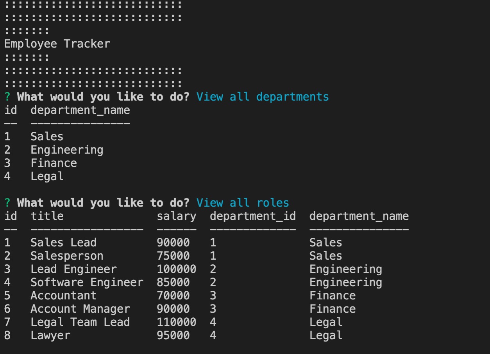
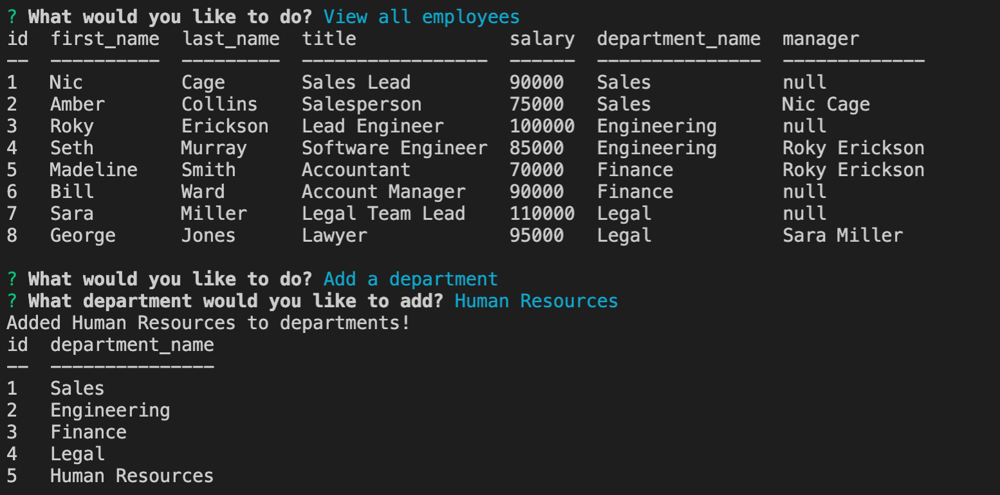

# Employee Tracker

## Purpose
User is able to view employees for a particular company to include roles, salaries, and departments.  User can update the company to add new employees, roles, and departments.

## Built With
* JavaScript
* Node
* Mysql

## Installation
Node, Mysql

## Contribution
Made by Jon Prine

## Video Walkthrough
https://drive.google.com/file/d/1mY4v-3GbOQzR-omL36wpfuSuAQTzLH3X/view

## Screenshots of Finished Page

